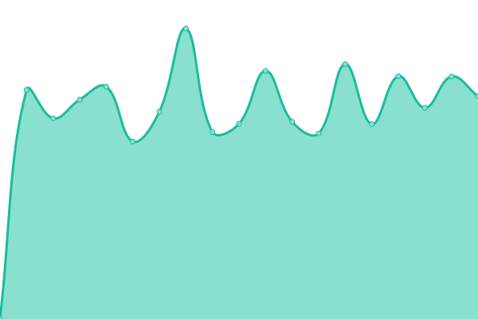
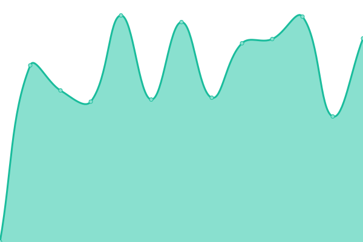
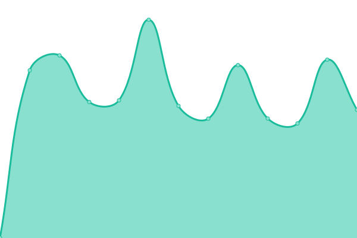
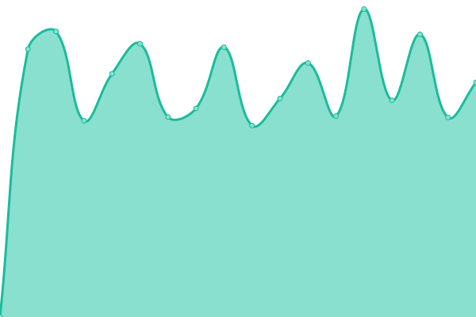

# [📈 Live Status](https://demo.upptime.js.org): <!--live status--> **🟩 All systems operational**

This repository contains the open-source uptime monitor and status page for [Network For Gamers](https://networkforgamers.com), powered by [Upptime](https://github.com/upptime/upptime).

With [Upptime](https://upptime.js.org), you can get your own unlimited and free uptime monitor and status page, powered entirely by a GitHub repository. We use [Issues](https://github.com/Network-For-Gamers/upptime/issues) as incident reports, [Actions](https://github.com/Network-For-Gamers/upptime/actions) as uptime monitors, and [Pages](https://network-for-gamers.github.io/upptime/) for the status page.

<!--start: status pages-->
<!-- This summary is generated by Upptime (https://github.com/upptime/upptime) -->
<!-- Do not edit this manually, your changes will be overwritten -->
<!-- prettier-ignore -->
| URL | Status | History | Response Time | Uptime |
| --- | ------ | ------- | ------------- | ------ |
|  [NFG](https://networkforgamers.com) | 🟩 Up | [nfg.yml](https://github.com/Network-For-Gamers/upptime/commits/HEAD/history/nfg.yml) | 

 1084ms
     
 | 

<a href="https://uptime.serversforyou.com/history/nfg">100.00%</a>
    

|  [NFG CDS](https://cds.networkforgamers.com) | 🟩 Up | [nfg-cds.yml](https://github.com/Network-For-Gamers/upptime/commits/HEAD/history/nfg-cds.yml) | 

 1382ms
     
 | 

<a href="https://uptime.serversforyou.com/history/nfg-cds">100.00%</a>
    

|  [NFG Discord](https://discord.networkforgamers.com) | 🟩 Up | [nfg-discord.yml](https://github.com/Network-For-Gamers/upptime/commits/HEAD/history/nfg-discord.yml) | 

 545ms
     
 | 

<a href="https://uptime.serversforyou.com/history/nfg-discord">100.00%</a>
    

|  [NFG Minecraft](https://minecraft.networkforgamers.com) | 🟩 Up | [nfg-minecraft.yml](https://github.com/Network-For-Gamers/upptime/commits/HEAD/history/nfg-minecraft.yml) | 

 1021ms
     
 | 

<a href="https://uptime.serversforyou.com/history/nfg-minecraft">100.00%</a>
    

|  [NFG MC](mc.networkforgamers.com) | 🟩 Up | [nfg-mc.yml](https://github.com/Network-For-Gamers/upptime/commits/HEAD/history/nfg-mc.yml) | 

 130ms
     
 | 

<a href="https://uptime.serversforyou.com/history/nfg-mc">100.00%</a>
    

|  [NFG MC RPG](mc.networkforgamers.com) | 🟩 Up | [nfg-mc-rpg.yml](https://github.com/Network-For-Gamers/upptime/commits/HEAD/history/nfg-mc-rpg.yml) | 

 128ms
     
 | 

<a href="https://uptime.serversforyou.com/history/nfg-mc-rpg">98.00%</a>
    

|  [NFG Rust](https://rust.networkforgamers.com) | 🟩 Up | [nfg-rust.yml](https://github.com/Network-For-Gamers/upptime/commits/HEAD/history/nfg-rust.yml) | 

 1803ms
     
 | 

<a href="https://uptime.serversforyou.com/history/nfg-rust">100.00%</a>
    

|  [SFU](https://serversforyou.com) | 🟩 Up | [sfu.yml](https://github.com/Network-For-Gamers/upptime/commits/HEAD/history/sfu.yml) | 

 1251ms
     
 | 

<a href="https://uptime.serversforyou.com/history/sfu">100.00%</a>
    

|  [SFU Discord](https://discord.serversforyou.com) | 🟩 Up | [sfu-discord.yml](https://github.com/Network-For-Gamers/upptime/commits/HEAD/history/sfu-discord.yml) | 

 505ms
     
 | 

<a href="https://uptime.serversforyou.com/history/sfu-discord">100.00%</a>
    

|  [SFU Gaming](https://gaming.serversforyou.com) | 🟩 Up | [sfu-gaming.yml](https://github.com/Network-For-Gamers/upptime/commits/HEAD/history/sfu-gaming.yml) | 

 779ms
     
 | 

<a href="https://uptime.serversforyou.com/history/sfu-gaming">100.00%</a>
    

|  [SFU Web](https://web.serversforyou.com) | 🟩 Up | [sfu-web.yml](https://github.com/Network-For-Gamers/upptime/commits/HEAD/history/sfu-web.yml) | 

 1690ms
     
 | 

<a href="https://uptime.serversforyou.com/history/sfu-web">100.00%</a>
    

|  [SFU Node 1](https://node1.serversforyou.com) | 🟩 Up | [sfu-node-1.yml](https://github.com/Network-For-Gamers/upptime/commits/HEAD/history/sfu-node-1.yml) | 

 918ms
     
 | 

<a href="https://uptime.serversforyou.com/history/sfu-node-1">100.00%</a>
    

<!--end: status pages-->

[**Visit our status website →**](https://network-for-gamers.github.io/upptime/)

## 📄 License

- Powered by: [Upptime](https://github.com/upptime/upptime)
- Code: [MIT](./LICENSE) © [Anand Chowdhary](https://anandchowdhary.com), supported by [Pabio](https://pabio.com)
- Data in the `./history` directory: [Open Database License](https://opendatacommons.org/licenses/odbl/1-0/)
